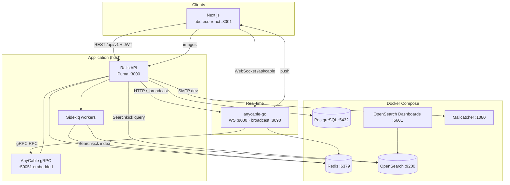

# uButeco

[](https://travis-ci.org/Sartori-RIA/ubuteco_api)
[](https://codeclimate.com/github/Sartori-RIA/ubuteco_api/maintainability)
[](https://codeclimate.com/github/Sartori-RIA/ubuteco_api/test_coverage)
[](https://github.com/rubocop-hq/rubocop-rails)


### System architecture

High-level view of how the main pieces connect in **local development** (Next.js + Rails on the host, infrastructure in Docker Compose).


**Roadmap / improvement plans:** [docs/plans/README.md](docs/plans/README.md) — multi-tenant through CI/CD, order lifecycle, inventory, users API, and more.

**AI assistants:** [AGENTS.md](AGENTS.md) · [docs/context/](docs/context/) · [docs/dev-setup.md](docs/dev-setup.md)

#### Components

| Component | Role | Default URL / port |
|-----------|------|-------------------|
| **ubuteco-react** (Next.js) | Staff UI (orders, kitchen, catalog, settings) — **only active frontend** | `http://localhost:3001` |
| **Rails API** (Puma) | REST API, JWT auth, business logic, Active Storage | `http://localhost:3000` |
| **PostgreSQL** | Primary database (orders, menu, orgs, users) | `localhost:5432` |
| **Redis** | Sidekiq queue; AnyCable pub/sub | `localhost:6379` |
| **Sidekiq** | Background jobs (Searchkick indexing, etc.) | (no HTTP; uses Redis) |
| **OpenSearch** | Full-text search index (via Searchkick) | `http://localhost:9200` |
| **OpenSearch Dashboards** | Search cluster UI (dev/debug) | `http://localhost:5601` |
| **anycable-go** | WebSocket server (real-time) | WS `ws://localhost:8080/api/cable`, broadcast `:8090` |
| **Mailcatcher** | Catches outbound email in dev | UI `http://localhost:1080`, SMTP `:1025` |

**Frontend:** all new work goes to **[ubuteco-react](../ubuteco-react)**. The old Angular app ([ubuteco_spa](https://github.com/Sartori-RIA/ubuteco_spa)) is **abandoned** — no migration or feature parity effort; it would need a full rewrite and is out of scope.

#### Connection map (who talks to whom)

| From | To | Protocol | Purpose |
|------|-----|----------|---------|
| Next.js | Rails | HTTPS + JWT | CRUD: orders, items, menu, orgs, users, kitchen REST |
| Next.js | Rails | HTTPS | Images (`/uploads`, Active Storage) |
| Next.js | anycable-go | WebSocket + `?token=` | Live kitchen queue (`KitchenChannel`) |
| anycable-go | Rails | gRPC `:50051` | Connect, subscribe, channel RPC |
| Rails | anycable-go | HTTP `POST /_broadcast` | Push real-time messages to clients |
| Rails | PostgreSQL | SQL | Persistence |
| Rails | Redis | Redis | Enqueue Sidekiq jobs |
| Sidekiq | Redis | Redis | Dequeue jobs |
| Sidekiq | OpenSearch | HTTP | Index/update search documents (Searchkick `callbacks: :async`) |
| Rails | OpenSearch | HTTP | Search queries (controllers using Searchkick) |
| Rails | Mailcatcher | SMTP | Dev emails |
| OpenSearch Dashboards | OpenSearch | HTTP | Cluster inspection |
| anycable-go | Redis | Redis | Pub/sub between AnyCable nodes |

#### Diagram (Mermaid)



#### Search (OpenSearch + Searchkick)

Indexed models include **User**, **Order**, **Organization**, **Beer**, **Wine**, **Drink**, **Food**, **Dish**, **Maker** (`searchkick callbacks: :async`). Writes go to PostgreSQL first; Sidekiq updates OpenSearch. API search endpoints read from OpenSearch with CanCanCan-scoped filters (`SearchkickAuthorizable`).

Start the search stack:

```bash
docker-compose up -d opensearch-node1 opensearch-node2 opensearch-dashboards
```

### Requirements

+ [Frontend (Next.js)](../ubuteco-react) — **sole active UI** (Angular `ubuteco_spa` abandoned, not maintained)
+ [Swagger Docs](https://sartori-ria.github.io/ubuteco_api/)

+ With Docker
  + Docker
  + Docker compose
  
+ Without Docker
  + Postgres
  + Rails 7.1.x
  + Ruby 3.2.2

### Quick Start

1. `cp config/application.yml.example config/application.yml` -> create environment file
2. `docker-compose up -d` -> start docker environment
3. `docker exec -it ubuteco_api /bin/bash` -> enter in docker container
4. `rails db:setup` -> create tables and database updates
5. `rails db:migrate` -> create tables and database updates
6. `rails db:seed` -> populate database with real data
7. `rails db:populate` -> populate database with fake data
8. `rspec` -> run all tests
9. `bundle exec rails parallel:setup` -> setup the db for parallel specs
10. `bundle exec rails parallel:spec` -> run all specs in parallel
11. `rails s -b 0.0.0.0` -> start server

### Swagger 

+ `http://localhost:3000/api-docs`

### Endpoints (quick reference)

| URL | Description |
|-----|-------------|
| `http://localhost:3000/api/v1` | REST API |
| `http://localhost:3000/auth` | Devise JWT auth |
| `http://localhost:3000/api-docs` | Swagger UI |
| `ws://localhost:8080/api/cable` | WebSocket (AnyCable) |
| `http://localhost:8090/_broadcast` | Rails → AnyCable broadcasts (internal) |
| `http://localhost:9200` | OpenSearch |
| `http://localhost:5601` | OpenSearch Dashboards |

### Real-time (AnyCable)

Kitchen and other Action Cable channels use **[AnyCable](https://anycable.io)** (`anycable-go` + embedded gRPC in Puma). See [System architecture](#system-architecture) above.

**Local setup**

1. `docker-compose up -d cache anycable-ws`
2. `bin/rails s` (embedded gRPC on `:50051`)
3. Next.js: `CABLE_URL=ws://localhost:8080/api/cable` in `ubuteco-react/.env`

**Channels:** `KitchenChannel` → stream `kitchens_{organization_id}`.

**Production:** [AnyCable deployment](https://docs.anycable.io/deployment) — set `ANYCABLE_SECRET`, `ANYCABLE_WEBSOCKET_URL`, `ANYCABLE_HTTP_BROADCAST_URL`, `ANYCABLE_RPC_HOST`.


### Default users in db:populate

+ Emails
  + `customer@email.com`
  + `cash_register@email.com`
  + `waiter@email.com`
  + `kitchen@email.com`
  + `admin@email.com`
  + `super@email.com`

+ passwords:
  + `123123123`
  
## Contributing

* Fork it
* Write your changes
* Commit
* Send a pull request

## Supporters


