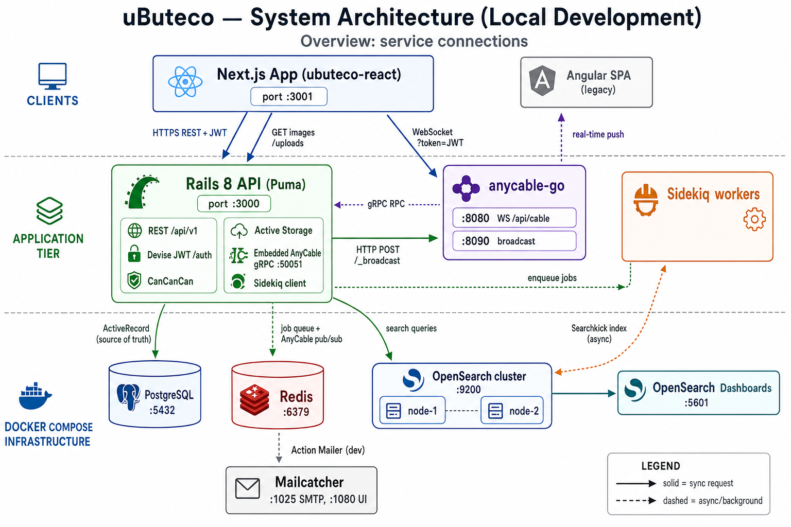
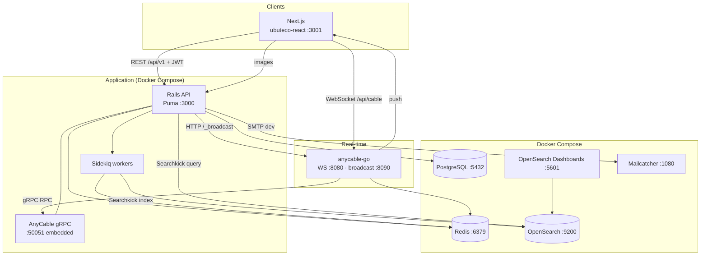

# uButeco

[](https://github.com/Sartori-RIA/ubuteco_api/actions/workflows/ci.yml)
[](https://codecov.io/gh/Sartori-RIA/ubuteco_api)
[](https://github.com/rubocop-hq/rubocop-rails)


### System architecture

High-level view of how the main pieces connect in **local development** (Docker Compose runs infra + API + Sidekiq; Next.js on the host).



> **Note:** The diagram may still show Rails on the host. The recommended dev flow runs **API and Sidekiq in Docker** — see [Quick Start](#quick-start) and [docs/dev-setup.md](docs/dev-setup.md).

**Roadmap / improvement plans:** [docs/plans/README.md](docs/plans/README.md) — multi-tenant through CI/CD, order lifecycle, inventory, users API, and more.

**AI assistants:** [AGENTS.md](AGENTS.md) · [docs/context/](docs/context/) · [docs/dev-setup.md](docs/dev-setup.md)

#### Components

| Component | Role | Default URL / port |
|-----------|------|-------------------|
| **ubuteco-react** (Next.js) | Staff UI (orders, kitchen, catalog, settings) — **only active frontend** | `http://localhost:3001` (or `:4000` if busy) |
| **Rails API** (Puma) | REST API, JWT auth, business logic, Active Storage | `http://localhost:3000` |
| **PostgreSQL** | Primary database (orders, menu, orgs, users) | `localhost:5432` |
| **Redis** | Sidekiq queue; AnyCable pub/sub | `localhost:6379` |
| **Sidekiq** | Background jobs (Searchkick indexing, etc.) | (no HTTP; uses Redis) |
| **OpenSearch** | Full-text search index (via Searchkick) | `http://localhost:9200` |
| **OpenSearch Dashboards** | Search cluster UI (dev/debug) | `http://localhost:5601` |
| **anycable-go** | WebSocket server (real-time) | WS `ws://localhost:8080/api/cable`, broadcast `:8090` |
| **Mailcatcher** | Catches outbound email in dev | UI `http://localhost:1080`, SMTP `:1025` |

**Frontend:** all new work goes to **[ubuteco-react](../ubuteco-react)**. The old Angular app ([ubuteco_spa](https://github.com/Sartori-RIA/ubuteco_spa)) is **abandoned** — no migration or feature parity effort; it would need a full rewrite and is out of scope.

#### Connection map (who talks to whom)

| From | To | Protocol | Purpose |
|------|-----|----------|---------|
| Next.js | Rails | HTTPS + JWT | CRUD: orders, items, menu, orgs, users, kitchen REST |
| Next.js | Rails | HTTPS | Images (`/uploads`, Active Storage) |
| Next.js | anycable-go | WebSocket + `?token=` | Live kitchen queue (`KitchenChannel`) |
| anycable-go | Rails | gRPC `:50051` | Connect, subscribe, channel RPC |
| Rails | anycable-go | HTTP `POST /_broadcast` | Push real-time messages to clients |
| Rails | PostgreSQL | SQL | Persistence |
| Rails | Redis | Redis | Enqueue Sidekiq jobs |
| Sidekiq | Redis | Redis | Dequeue jobs |
| Sidekiq | OpenSearch | HTTP | Index/update search documents (Searchkick `callbacks: :async`) |
| Rails | OpenSearch | HTTP | Search queries (controllers using Searchkick) |
| Rails | Mailcatcher | SMTP | Dev emails |
| OpenSearch Dashboards | OpenSearch | HTTP | Cluster inspection |
| anycable-go | Redis | Redis | Pub/sub between AnyCable nodes |

#### Diagram (Mermaid)



#### Search (OpenSearch + Searchkick)

Indexed models include **User**, **Order**, **Organization**, **Beer**, **Wine**, **Drink**, **Food**, **Dish**, **Maker** (`searchkick callbacks: :async`). Writes go to PostgreSQL first; Sidekiq updates OpenSearch. API search endpoints read from OpenSearch with CanCanCan-scoped filters (`SearchkickAuthorizable`).

Start the search stack:

```bash
docker-compose up -d opensearch-node1 opensearch-node2 opensearch-dashboards
```

### Requirements

+ [Frontend (Next.js)](../ubuteco-react) — **sole active UI** (Angular `ubuteco_spa` abandoned, not maintained)
+ [Swagger Docs](https://sartori-ria.github.io/ubuteco_api/)

+ With Docker (recommended)
  + Docker + Docker Compose
  + Optional: Ruby/Bundler on the host if you run Rails outside containers

+ Without Docker (host Rails + Docker infra)
  + PostgreSQL 16, Redis 7, OpenSearch 2.x (or use Compose for infra only)
  + Rails 8.x
  + Ruby 4.0.1 (see `.ruby-version`)

### Quick Start

**Docker (recommended)** — API, Sidekiq, Postgres, Redis, OpenSearch, AnyCable, Mailcatcher:

```bash
cd ubuteco_api
cp .env-example .env          # optional; compose sets dev defaults
docker compose --profile app up -d --build  # first boot runs db:prepare (create + migrate)
```

Seed reference data and fake dev data:

```bash
docker compose exec api bin/rails db:seed
docker compose exec api bin/rails db:populate
```

Verify: `curl http://localhost:3000/up` → `{"status":"ok","redis":"ok"}`

**React** (sibling repo, separate terminal):

```bash
cd ../ubuteco-react
cp .env.example .env   # or create .env — see ubuteco-react/docs/dev-setup.md
npm install
npm run dev            # often :3001 or :4000 — check terminal output
```

React `.env` example:

```env
API_URL=http://localhost:3000/api
CABLE_URL=ws://localhost:8080/api/cable
```

Use your LAN IP instead of `localhost` when testing from another device.

**Host Rails (optional)** — infra only in Docker (`api`/`sidekiq` use compose profile `app`):

```bash
docker compose up -d db cache mailcatcher opensearch-node1 opensearch-node2 opensearch-dashboards anycable-ws
# In .env: ANYCABLE_RPC_HOST=host.docker.internal:50051
bundle install
bin/rails db:create db:migrate db:seed db:populate
bin/rails s
bundle exec sidekiq   # separate terminal
```

Full details: [docs/dev-setup.md](docs/dev-setup.md) · [docs/deploy-runbook.md](docs/deploy-runbook.md) (staging/production)

### Database tasks

| Task | Purpose |
|------|---------|
| `db:migrate` | Apply schema migrations |
| `db:seed` | Reference data (roles, beer/wine styles) |
| `db:populate` | Fake catalog + dev users (run **after** seed) |

Docker:

```bash
docker compose exec api bin/rails db:migrate
docker compose exec api bin/rails db:seed
docker compose exec api bin/rails db:populate
```

Fresh database:

```bash
docker compose exec api bin/rails db:drop db:create db:migrate db:seed db:populate
```

Host: replace `docker compose exec api` with `bin/rails`.

### Tests

```bash
bundle exec rspec
docker compose exec api bundle exec rspec   # inside API container
```

### CI (required checks)

Pull requests to `master` must pass [GitHub Actions](.github/workflows/ci.yml):

| Step | Command |
|------|---------|
| Brakeman | `bin/brakeman --quiet --no-pager --exit-on-warn --exit-on-error` |
| bundler-audit | `bin/bundler-audit check --update` |
| RSpec | `bundle exec rspec` (Postgres + OpenSearch service containers) |

Local full CI script: `bin/ci` (adds RuboCop). Coverage uploads to Codecov on push.

### Swagger 

+ `http://localhost:3000/api-docs`

### Endpoints (quick reference)

| URL | Description |
|-----|-------------|
| `http://localhost:3000/api/v1` | REST API |
| `http://localhost:3000/auth` | Devise JWT auth |
| `http://localhost:3000/api-docs` | Swagger UI |
| `ws://localhost:8080/api/cable` | WebSocket (AnyCable) |
| `http://localhost:8090/_broadcast` | Rails → AnyCable broadcasts (internal) |
| `http://localhost:9200` | OpenSearch |
| `http://localhost:5601` | OpenSearch Dashboards |

### Real-time (AnyCable)

Kitchen and other Action Cable channels use **[AnyCable](https://anycable.io)** (`anycable-go` + embedded gRPC in Puma). See [System architecture](#system-architecture) above.

**Local setup (Docker API — default)**

1. `docker compose --profile app up -d --build` (includes `anycable-ws`; RPC → `api:50051`)
2. Next.js: `CABLE_URL=ws://localhost:8080/api/cable` in `ubuteco-react/.env`

**Local setup (host Rails)**

1. `docker compose up -d cache anycable-ws` (+ db, opensearch as needed)
2. Set `ANYCABLE_RPC_HOST=host.docker.internal:50051` in `.env`
3. `bin/rails s` (embedded gRPC on `:50051`)
4. Next.js: `CABLE_URL=ws://localhost:8080/api/cable`

**Channels:** `KitchenChannel` → stream `kitchens_{organization_id}`.

**Production:** [AnyCable deployment](https://docs.anycable.io/deployment) — set `ANYCABLE_SECRET`, `ANYCABLE_WEBSOCKET_URL`, `ANYCABLE_HTTP_BROADCAST_URL`, `ANYCABLE_RPC_HOST`.


### Default users in db:populate

+ Emails
  + `customer@email.com`
  + `cash_register@email.com`
  + `waiter@email.com`
  + `kitchen@email.com`
  + `admin@email.com`
  + `super@email.com`

+ passwords:
  + `123123123`
  
## Contributing

* Fork it
* Write your changes
* Commit
* Send a pull request

## Supporters


