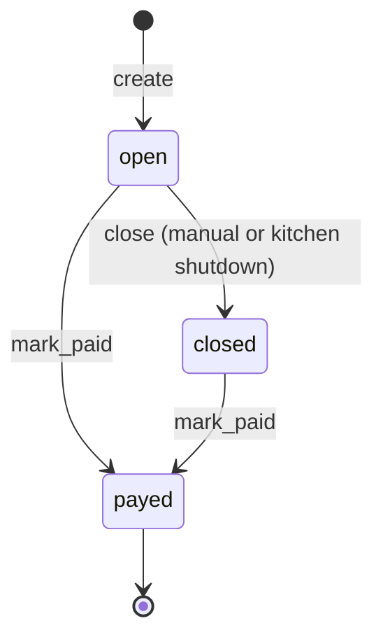
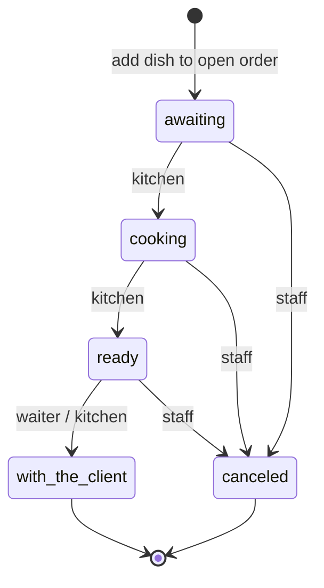
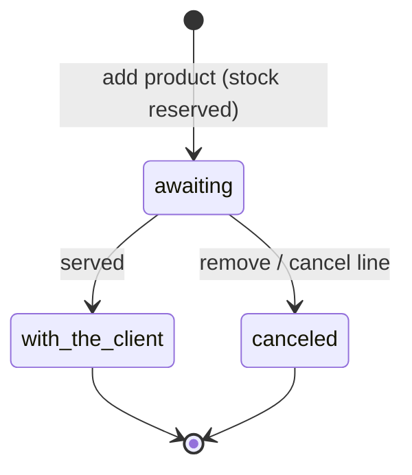

# Order lifecycle — state diagrams

Companion to [plan 06](./plans/06-order-lifecycle.md). Describes **current intended behaviour** after domain hardening.

---

## Order (`Order#status`)

| From | To | Who / trigger |
|------|-----|----------------|
| `open` | `closed` | Waiter/admin/cash register via `PATCH /orders/:id`; **auto** when org `operational_status` → `closed` |
| `open` | `payed` | Staff with order update permission (checkout) |
| `closed` | `payed` | Staff (pay after tab closed) |
| `payed` | — | Terminal — no reopen |

**Guards**

- Order items can only be **created/updated/destroyed** while order is `open` (CanCan + model validation).
- Org kitchen **closed** → kitchen API returns empty queue / 403 on status updates; open orders are bulk-closed.

---

## Order item — dish (kitchen queue)

Default status on create: `awaiting`.

Kitchen broadcast (AnyCable) fires on **create** and on **status change** when order and org are both `open`.

---

## Order item — non-dish (stock-backed products)

Default status on create: `awaiting` (enum default). No kitchen queue.

**Stock path:** create reserves stock; destroy releases; quantity change adjusts stock (`OrderItem#apply_quantity_change!`). Dishes skip stock hooks.

Statuses `cooking`, `ready`, `empty_stock` are **not used** on non-dish lines (invalid transition if attempted).

---

## Role × action matrix

| Action | Waiter | Kitchen | Cash register | Admin | Customer |
|--------|--------|---------|---------------|-------|----------|
| Create order | ✓ | — | ✓ | ✓ | ✓ (own org) |
| Read orders (org) | ✓ | — | ✓ | ✓ | — |
| Update open order (discount, table, status) | ✓ | — | ✓ | ✓ | — |
| Add / update / remove items (open order) | ✓ | — | ✓ | ✓ | — |
| Read kitchen queue | ✓ | ✓ | ✓ | ✓ | — |
| Update dish item status | ✓* | ✓ | ✓* | ✓* | — |
| Close org kitchen (`operational_status`) | — | — | ✓ | ✓ | — |
| Auto-close open orders | — | — | — | — | — (system on kitchen close) |

\*Waiter/admin/cash register can update item status via order items API; kitchen role uses `/api/v1/kitchens/:id`.

---

## Services (domain entry points)

| Service | Responsibility |
|---------|----------------|
| `Orders::AddItem` | Build + save item, stock + total side effects |
| `Organizations::CloseKitchen` | Bulk-close open orders when org kitchen closes |
| `Kitchen::UpdateItemStatus` | *(planned)* kitchen status transitions with org guard |
| `Orders::RemoveItem` | *(planned)* destroy + stock release |
